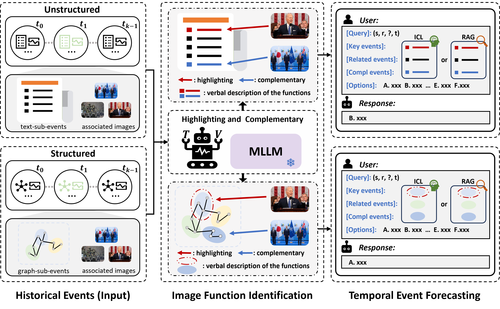
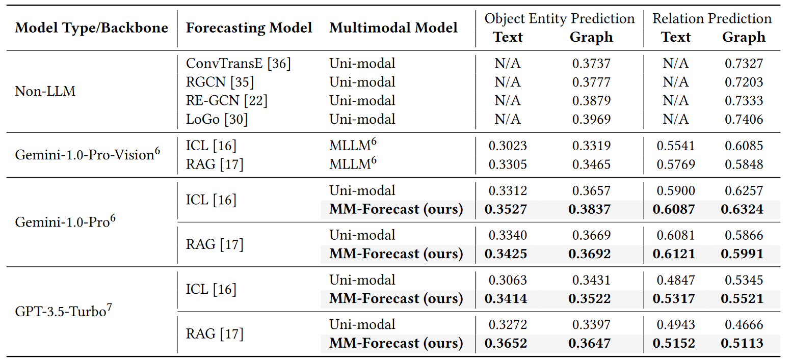
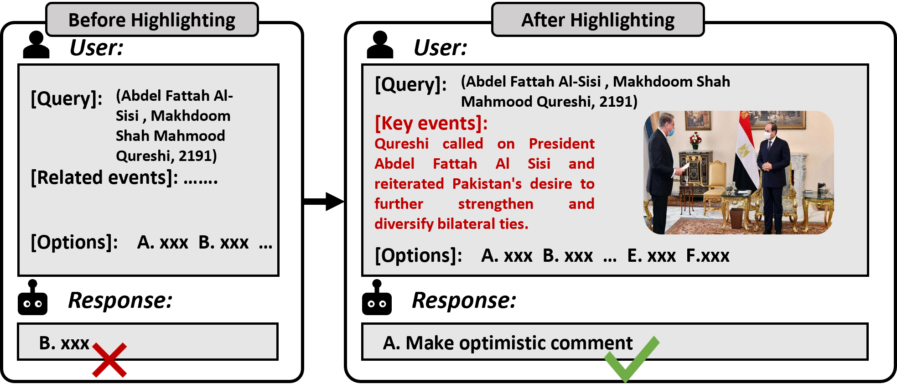
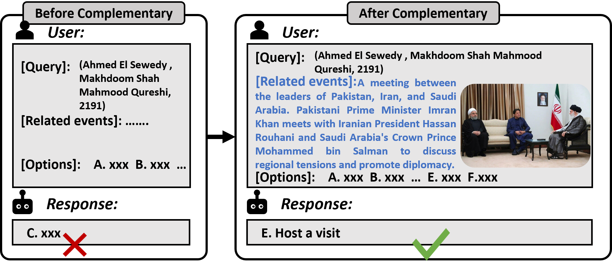

# MM-Forecast

This repository contains the code, data for the paper titled "[MM-Forecast: A Multimodal Approach to Temporal Event Forecasting with Large Language Models](https://arxiv.org/pdf/2408.04388)".

## Latest News 🔥
* [2024-8-20] We released [code](https://github.com/LuminosityX/MM-Forecast), [MidEast-TE-mm dataset](https://github.com/LuminosityX/MM-Forecast/datasets_forecasting) of forecasting.
* [2024-7-16] The paper has been accepted by ACM MM 2024 (🎉🎉🎉).

## Framework



## Requirements 
For details, check the [mm_forecsat.yaml](https://github.com/LuminosityX/MM-Forecast/mm_forecsat.yaml) file. You can complete the configuration of the environment with the following command: 
```bash
conda env create -f mm_forecast.yaml
```

## Dataset
The datasets of forecastig are in the folder 'datasets_forecasting'. Place the data in the root or other directory.
Data structure:
```
├── datasets_forecasting/
│   ├── text/
│     ├── event/
│       ├── all_dataset.csv                       
│       ├── final_test.csv                          (events in the test set)
│     ├── function_json/
│       ├── sum_gemini_all.json                     (summary of news texts)
│       ├── classification_gemini_all.json          (relation between news and images)
│       ├── aligned_gemini_all.json                 (highlighting function of image)
│       ├── complementary_gemini_all.json           (complementary function of image)
│       ├── doc_list.json                           (raw news)
│       ├── Md52timid.json                          
│   ├── graph/
│     ├── event/
│       ├── ...
│     ├── function_json/
│       ├── ...
```

## Temporal Event Forecasting
Code file structure:
```
├── code_forecasting/
│   ├── text/
│     ├── ICL/              (related events are from 'Nearest_events_summary', 'Further_events_summary', and 'Related_facts_summary' in the dataset)
│       ├── object/         (candidate set is the 'Candidates' in the dataset)
│         ├── text_only.py
│         ├── w_image.py
│       ├── relation/       (candidate set is the 'Candidates_relation ' in the dataset)
│         ├── text_only.py
│         ├── w_image.py
│     ├── RAG/              (related events are retrieved.)
│       ├── object/         (candidate set is the 'Candidates' in the dataset)
│         ├── text_only.py
│         ├── w_image.py
│       ├── relation/       (candidate set is the 'Candidates_relation ' in the dataset)
│         ├── text_only.py
│         ├── w_image.py
│   ├── graph/
│     ├── ICL/              (related events are from 'Nearest_events_object/relation', 'Further_events_object/relation', and 'Related_Facts_object/relation' in the dataset)
│       ├── ...
│     ├── RAG/              (related events are retrieved.)
│       ├── ...
```
We refer to the root path as '$ROOT_PATH$', and the file you want to run as '$FILE_EF$'. You can run the following code for temporal event forecsating:
'''python
python '$FILE_EF$' root_path='$ROOT_PATH$'
'''

## Results


## Cases
'Highlighting' examples:
<div align=center>

</div>

'Complementary' examples:
<div align=center>

</div>

## Acknowledgement
If you find our work helpful to your research, please consider citing us with this BibTeX:
```bibtex
@inproceedings{MM24MM-Forecast,
  author    = {Li, Haoxuan and Yang, Zhengmao and Ma, Yunshan and Bin, Yi and Yang, Yang and Chua, Tat-Seng}
  title     = {MM-Forecast: A Multimodal Approach to Temporal Event Forecasting with Large Language Models},
  booktitle = {Proceedings of the 32nd ACM International Conference on Multimedia, 28 October – 1 November, 2024, Melbourne, Australia.},
  year      = {2024},
}
```
